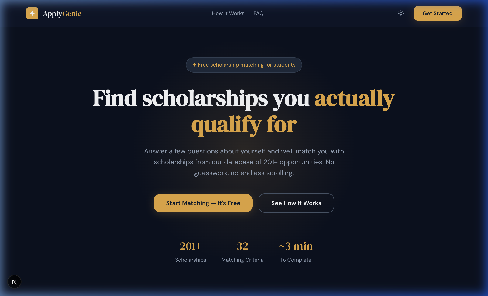

# Apply Genie Website
A modern Next.js web application for students to discover scholarships they actually qualify for through an intelligent matching questionnaire.

<picture>
  <source media="(prefers-color-scheme: dark)" srcset="./public/hero-dark.png">
  <source media="(prefers-color-scheme: light)" srcset="./public/hero-light.png">
  
</picture>

## Quick Start
```bash
npm install
npm run dev
```

## Features
- **Dynamic Scholarship Matching**: Walk through a responsive, step-by-step questionnaire that dynamically updates based on your previous answers.
- **Robust Authentication**: Powered by Clerk to provide secure, seamless sign-in and sign-up flows for students.
- **Light & Dark Mode**: A beautifully crafted UI using CSS modules and semantic variables that fully supports system and manual theme toggling.
- **In-Memory Matching Engine**: Filters and evaluates scholarship eligibility on the fly using a fast, local Next.js API route without requiring heavy database queries.
- **Dashboard & Saved Scholarships**: Log in to view your eligibility profile completion, stats, and manage bookmarked scholarships.

## How to run locally

### Prerequisites
- **Node.js**: v18+ recommended.
- **Clerk Account**: You need a Clerk Application for user authentication.

### Setup Steps
1. **Clone and Install**
   ```bash
   git clone https://github.com/your-username/apply-genie-website.git
   cd apply-genie-website
   npm install
   ```

2. **Environment Variables**
   Create a `.env` file in the root directory and add your Clerk credentials:
   ```env
   NEXT_PUBLIC_CLERK_PUBLISHABLE_KEY=pk_test_...
   CLERK_SECRET_KEY=sk_test_...
   ```

3. **Start the Development Server**
   ```bash
   npm run dev
   ```
   The application will be available at [http://localhost:3000](http://localhost:3000).

## How it works
This repository represents the frontend and user-facing experience of the Apply Genie ecosystem. It is built using **Next.js (App Router)** and relies on standard CSS modules for styling, intentionally avoiding utility-class frameworks to maintain complete control over dynamic theme semantics (e.g. glassmorphism).

The scholarship matching logic lives within a server-side Next.js API route (`/api/scholarships`). Instead of building complex SQL graph queries to determine eligibility, the API route reads from a static JSON database and evaluates user profiles in-memory. This allows for incredibly fast filtering across 200+ scholarships without architectural overhead.

Auth is handled via Clerk, which provides robust JWT-based session management while enabling the frontend to effortlessly conditionally render the Dashboard and Save buttons based on the user's active session.

## Credits
- Built with [Next.js](https://nextjs.org/) and [React](https://react.dev/).
- Authentication by [Clerk](https://clerk.com/).
- Icons provided by [Lucide](https://lucide.dev/).
- The backend data scraper repository can be found at `apply-genie`.
